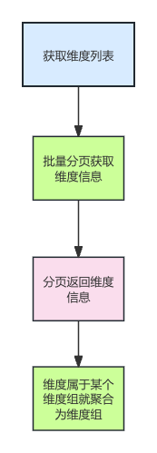

# 问题描述

在指标体系需求中，其中有一个功能点是：获取全量的维度信息。功能的流程图如下

  
根据上述的流程图可以看出，我们需要分页拉取数据，采用了并发去拉取全量维度数据。当时我们列出了以下方案(3C 方案法)：

| 序号 |       方案       |       优点       |      缺点      |
| :--: | :--------------: | :--------------: | :------------: |
|  1   | 串行请求分页接口 | 编程简单，易实现 | 批次多，耗时长 |
|  2   | 并行请求分页接口 | 编程简单，易实现 | 批次多，耗时长 |

有问题的代码块：

```java showLineNumbers
 // 将第一页数据加入结果集
            resDTO.getDimList().forEach(dto -> resultMap.put(dto.getDimEnName(), dto));
            // 2. 计算总页数
            int totalPages = (int) Math.ceil((double) totalSize / pageSize);

            // 3. 使用CountDownLatch等待所有任务完成
            CountDownLatch latch = new CountDownLatch(totalPages);

            // 4. 提交剩余页的获取任务到线程池
            for (int i = 0; i <= totalPages; i++) {
                final int currentPage = i;
                callExecutorThreadPool.execute(() -> {
                    try {
                        // 请求间隔10毫秒
                        Thread.sleep(10);
                        // 获取当前页数据
                        DimQueryResDTO pageData = openApiClient.getAllDimensionList(currentPage, pageSize);
                        // 合并数据到结果集
                        pageData.getDimList().forEach(dto ->
                            resultMap.putIfAbsent(dto.getDimEnName(), dto));
                        //塞入数据
                    } catch (InterruptedException e) {
                        Thread.currentThread().interrupt();
                    } finally {
                        latch.countDown();
                    }
                });
            }

            // 等待所有任务完成
            latch.await();
            // 5. 转换为List返回
            allData = new ArrayList<>(resultMap.values());
```

大家可以停1分钟，看看这段代码有什么问题。

出现的问题是：有一些维度会缺失

为什么会缺失呢？因为for循环多循环了一次，查询了一波空数据返回，导致CountDownLatch还未等到有内容的最后一页就提前结束。

大家都了解CountDownLatch的应用场景，那么底层原理怎么实现？知己知彼百战百胜，下面就进入CountDownLatch的原理分析。

# CountDownLatch的原理分析
## 流程图分析
https://www.cnblogs.com/cxuanBlog/p/14166322.html


